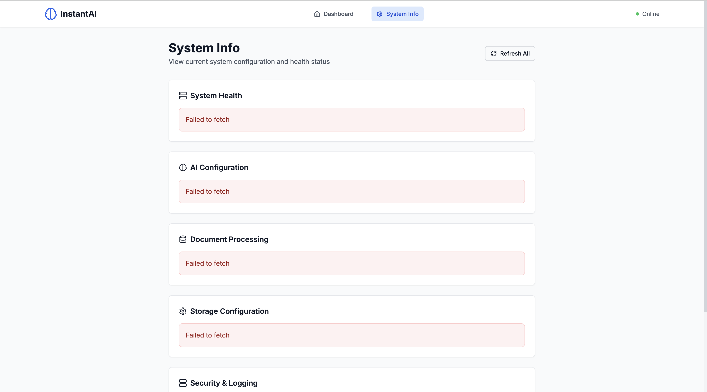
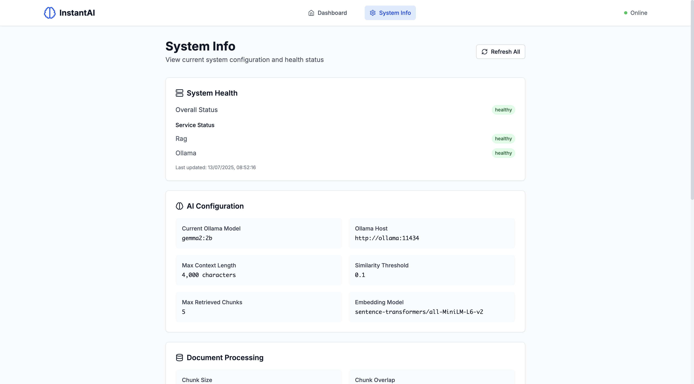

# InstantAI - AI-Powered Document Intelligence Platform

InstantAI is a full-stack AI application that makes creating intelligent document assistants as simple as drag-and-drop. No coding, no AI expertise, no complex setup required - just upload your documents and get a trained AI agent ready to answer questions.

## Architecture

**Built with modern, production-ready technologies:**

- **Database**: PostgreSQL 16 with pgvector extension for vector similarity search
- **Backend**: FastAPI with async SQLAlchemy and pgvector integration
- **Frontend**: React with TypeScript and Tailwind CSS
- **AI**: Ollama for local LLM inference with customizable models
- **Vector Embeddings**: sentence-transformers for semantic search
- **Containerization**: Docker Compose for easy deployment

## The Problem It Solves

Imagine: You need to create a RAG (Retrieval-Augmented Generation) system to help new employees get answers about company policies, procedures, and knowledge without needing someone to sit next to them all day explaining everything.

Traditionally, this would mean you need to:

- Learn complex AI and machine learning concepts
- Set up vector databases and embedding models
- Write code to process documents and handle queries
- Manage infrastructure and deployment
- Spend weeks or months building something from scratch

**InstantAI solves this** by providing a centralized platform where anyone - technical or not - can simply drag and drop their documents and instantly get a trained AI assistant.

## Quick Demo

https://github.com/user-attachments/assets/5d3484e9-48d1-4dd2-8802-28cebb44b303

## Docker Compose Architecture

The application uses a sophisticated Docker Compose setup with four interconnected services:

### Database Service

- **Base**: PostgreSQL 16 with pgvector extension
- **Ports**: 5432

### Backend Service

- **Base**: FastAPI with async Python
- **Ports**: 8000

### Frontend Service

- **Base**: React with TypeScript
- **Ports**: 3000

### Ollama Service

- **Base**: Ollama official image
- **Ports**: 11434

## Getting Started

### Prerequisites

- Docker and Docker Compose
- At least 8GB RAM (for AI models)
- 10GB free disk space

### Installation

1. **Clone the repository**:

   ```bash
   git clone https://github.com/edisonyls/instantAI
   cd instantAI
   ```

2. Launch the Application

   ```bash
   # Start all services with automatic model download
   docker-compose up --build

   # Or run in background
   docker-compose up -d --build
   ```

3. Wait for Initialization

   The first startup downloads the Gemma2:2b model (~1.6GB). This process happens automatically but can take several minutes depending on your internet connection.

   **Monitor the installation progress:**

   ```bash
   # Check logs to see download progress
   docker-compose logs -f ollama
   ```

   **Visual Status Indicators:**

   When you check the Ollama service status at <http://localhost:11434>, you'll see different responses:

   - **Not Ready** (Model still downloading):
     

   - **Ready** (Model downloaded and loaded):
     

   **Alternative verification methods:**

   ```bash
   # Verify model is ready via API
   curl http://localhost:11434/api/tags

   # Check if Gemma2:2b is listed in the response
   curl http://localhost:11434/api/show -d '{"name": "gemma2:2b"}'
   ```

   ⚠️ **Important**: Don't proceed to the next step until Ollama shows the "Ready" status. The backend service depends on the model being fully loaded.

4. Access the Application

   - **Frontend**: <http://localhost:3000>
   - **Backend API**: <http://localhost:8000>
   - **API Documentation**: <http://localhost:8000/docs>

5. Upload and Chat

   - Navigate to <http://localhost:3000>
   - Upload .docx files
   - Wait for processing completion
   - Start chatting with your document in <http://localhost:3000/chat>!

6. Generate API Keys (Optional)
   You can integrate your trained AI assistant into your own applications. To do this, you will need to:

   - Create a new knowledge base through the web interface (this automatically generates an API key)
   - Find your API key in the knowledge base details page
   - Use the API key to build custom chatbots, integrate into websites, or create mobile apps

## Conversation History & Context Management

I have implemented a conversation history management system that maintains context across chat sessions.

### How It Works

#### 1. Session-Based Storage

- **Session Management**: Each conversation is tracked via a unique `session_id` that persists across API calls
- **File-Based Storage**: Conversations are stored as JSON files in `data/conversations/` directory
- **Auto-Generated Sessions**: If no session ID is provided, the system automatically generates one using UUID

#### 2. Context Preservation Strategy

The application uses a **sliding window approach** for conversation context:

- **Storage Limit**: Up to 20 messages per conversation are stored (configurable via `max_conversation_length`)
- **Context Window**: Only the last 10 messages are included in AI prompts (configurable via `max_messages` parameter)
- **Automatic Pruning**: When conversations exceed 20 messages, older messages are automatically removed to prevent memory overflow

#### 3. Lifecycle Management

- **TTL**: Conversations automatically expire after 24 hours of inactivity
- **Cleanup Service**: Expired conversations are automatically deleted to prevent storage bloat
- **Error Handling**: Robust error handling ensures conversation failures don't break the chat experience

#### No Summarization (Yet)

Currently, the application does **not** implement conversation summarization. Instead, it uses:

- **Hard Limits**: Maximum 20 stored messages per session
- **Context Windows**: Only recent messages (last 10) are sent to the AI
- **Time-Based Expiry**: Old conversations are automatically cleaned up

## API Documentation

### Knowledge Base Management

```bash
# Create a knowledge base
curl -X POST http://localhost:8000/api/v1/knowledge-bases \
  -H "Content-Type: application/json" \
  -d '{"name": "Company Policies", "description": "HR and company policies"}'

# List knowledge bases
curl http://localhost:8000/api/v1/knowledge-bases

# Get specific knowledge base
curl http://localhost:8000/api/v1/knowledge-bases/{kb_id}
```

### Document Management

```bash
# Upload a document (requires API key in header)
curl -X POST http://localhost:8000/api/v1/documents/upload \
  -H "X-API-Key: your-api-key" \
  -F "file=@document.txt"

# List documents
curl -H "X-API-Key: your-api-key" \
  http://localhost:8000/api/v1/documents

# Delete a document
curl -X DELETE -H "X-API-Key: your-api-key" \
  http://localhost:8000/api/v1/documents/{document_id}
```

### Chat Interface

```bash
# Chat with your documents
curl -X POST http://localhost:8000/api/v1/chat \
  -H "Content-Type: application/json" \
  -d '{
    "message": "What is our remote work policy?",
    "api_key": "your-api-key",
    "session_id": "user-session-123",
    "model": "gemma2:2b"
  }'
```

### System Management

```bash
# Health check
curl http://localhost:8000/api/v1/health

# System information and statistics
curl http://localhost:8000/api/v1/system/info

# Clean up expired conversations
curl -X POST http://localhost:8000/api/v1/conversations/cleanup
```

### Model Configuration

The default model is Gemma2:2b (2 billion parameters) which provides:

- Fast inference on consumer hardware
- Good balance of quality and performance
- ~1.6GB download size

To use different models, update `OLLAMA_MODEL` and restart:

```bash
# For more capable models (requires more RAM)
OLLAMA_MODEL=llama3.1:8b
OLLAMA_MODEL=llama3.1:70b

# For faster inference
OLLAMA_MODEL=phi3:mini
```
